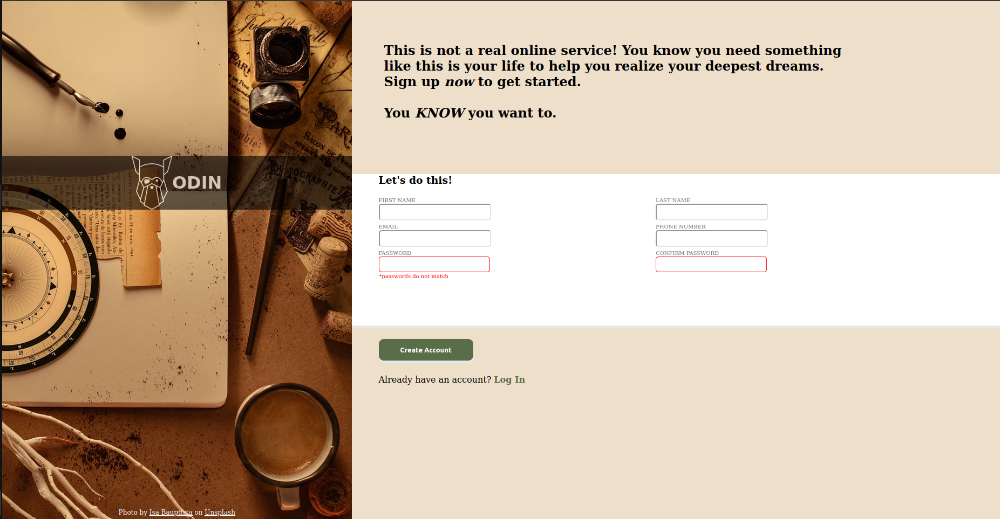

#  Sign-Up Form

This project is a simple and clean **sign-up form UI** built using **HTML and CSS**, as part of The Odin Project's curriculum. It demonstrates responsive form design, input field validation, and basic styling practices.

---

##  Screenshot

 <!-- Optional: Add a screenshot if you have one -->

---

## Features 8019652767

- Custom-styled form elements
- Password confirmation validation
- Clean, structured layout with modern styling
- Fully responsive (optional if you've made it responsive)

---

##  Tech

- HTML
- CSS

---

##  Getting Started

1. Clone this repo:
   ```bash
   git clone https://github.com/Ajbakaric/Sign-up-form.git
   cd Sign-up-form
   ```

2. Open `index.html` in your browser to view the form.

> ⚠️ If you're using Live Server, it may not auto-launch — manually open:
> `http://127.0.0.1:5500/index.html`

---


##  Folder Structure

```
Sign-up-form/
├── index.html
├── styles.css
└── README.md
```

---

##  Acknowledgments

This project was built as part of [The Odin Project](https://www.theodinproject.com/) curriculum.

---